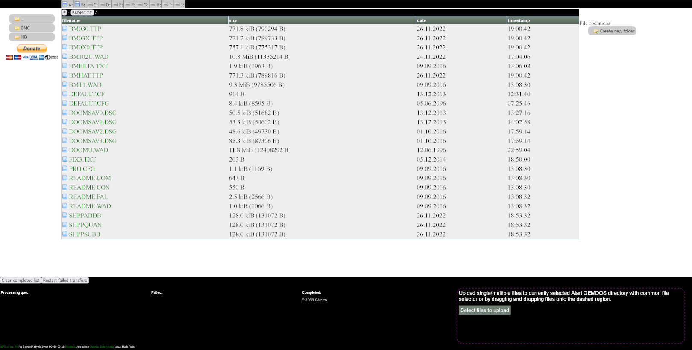

# Introduction

uip-tools brings an easy way to upload or download files to your beloved TOS machine with NetUSBee compatible network adapter without a need to MiNT or Sting TCP/IP stacks.
It is a self contained binary, including a TCP/IP based on uIP embedded stack with DHCP support.

# Building

prerequisities:
Cygwin or other Linux like environment
m68k atari cross compiler (http://vincent.riviere.free.fr/soft/m68k-atari-mint)
vasm m68k cross compiler (http://sun.hasenbraten.de/vasm)
GNU make
xxd

```
For CSS/JS minification automation in release builds:
nodeJS 11.9.0 https://nodejs.org/en/ 
from npm:
	npm install uglify-js -g
	npm install less -g
```

then:

```
bash# mkdir uip-tools.build  
bash# cd uip-tools.build
bash# scons -C ../uip-tools
```

It's possible to build the project with libcmini like follows:

```
bash#  LIBCMINI=/path/libcmini/libcmini/build/ scons -C ../uip-tools
```

This cuts about 100KB of the executable size.

If UPX is detected during the build then it will be used to compress the resulting in even smaller binary.

# Web interface
Interface relies on HTML5, so only modern browsers are supported (Firefox / Chrome). 

 

In upper part there is a list of GEMDOS drives detected. Clicking on them changes current GEMDOS drive and displays it's root directory. 
By default "C" drive is displayed, if there is no hard drive, only floppy drives are displayed and "A" drive is set as default active drive.
Below hard drive list on the left side there is list of folders, on the right side there is a list of files in current path. 
By clicking on directory in left panel or on breadcrumb elements above file view user can navigate through folder hierarchy on remote Atari machine. By clicking on file download to PC is initiated.

Bottom part is divided into two parts. 
Files and whole folders can be drag and dropped onto bottom / right part to initiate upload to currently set GEMDOS path. Alternatively clicking "Select files to upload" button will bring up system file selector, so desired files can be selected and uploaded.
Right portion of bottom panel displays the processing of upload que, shows failed and completed transfers.

# Available REST API

In addition to the HTML based user interface, uiptool allows you to use a simple REST API to do a range of operations. All examples are provided as curl shell invocations. 

* Upload a file:

		```
		curl -0T filename.tos 192.168.1.1/d/filename.tos
		```

	Note that you need to specify not only destination folder but also a file name!

* Download a file:

		```
		curl -0 192.168.1.1/c/filename.tos
		```

* Run an executable:

		```
		curl -0 192.168.1.1/c/filename.tos?run="command line"
		```

	The executable needs to be already present on the recent machine.

* Delete a file:

		```
		curl -0X DELETE 192.168.1.1/c/filename.tos
		```

* Create a folder

		```
		curl -0 192.168.1.1/c/foldername?newfolder
		```

* Request file info or directory listing in json format

		```
		curl -0 192.168.1.1/c/filename.tos?dir
		curl -0 192.168.1.1/c/foldername?dir
		```
